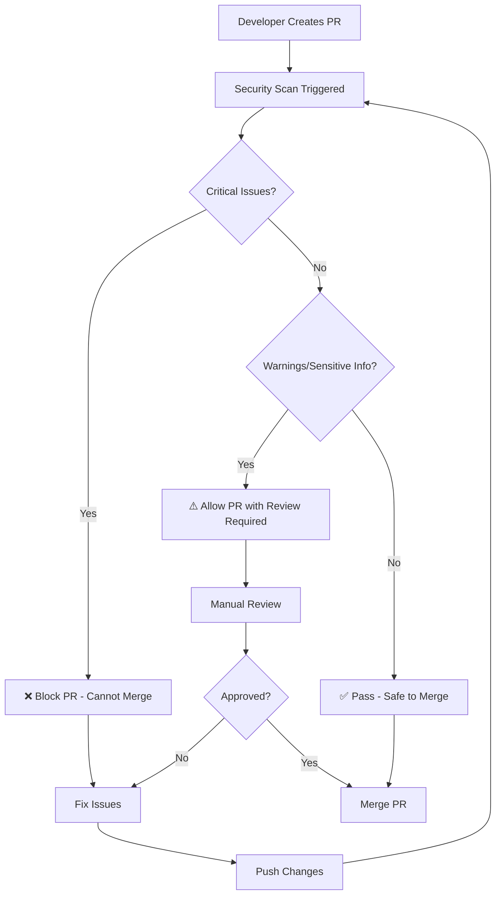

# Security Workflow for skills-for-fabric

## 🛡️ Automated Security Checks

This repository includes comprehensive automated security checks to prevent prompt injection attacks and protect sensitive information before open source release.

### 🤖 CI/CD Pipeline Integration

#### GitHub Actions Workflow
- **Trigger**: Every PR and push to main/master branch affecting skill files
- **Scope**: All `.md` files in `skills/` and `.github/skills/` directories
- **Actions**: 
  - Scans for prompt injection attack vectors
  - Detects sensitive information
  - Identifies malicious code patterns
  - Posts security report as PR comment
  - Blocks merge if critical issues found

#### Workflow File Location
```
.github/workflows/security-audit.yml
```

#### Security Scanner
```
.github/workflows/security_scanner.py
```

### 🚨 Security Check Categories

#### **CRITICAL Issues** (Block PR/Build)
- **Prompt Injection Risks**:
  - Instruction override attempts (`ignore previous instructions`)
  - Role manipulation (`act as if you are`)
  - Guideline bypass attempts (`override your guidelines`)
  - Memory wipe attempts (`forget everything`)
  
- **Malicious Code Patterns**:
  - Dynamic execution with user input (`eval(input())`)
  - Shell injection with user input (`subprocess.call(shell=True)`)
  - Unsafe deserialization (`pickle.loads(input())`)

#### **WARNING Issues** (Allow with Review)
- **Non-Critical Patterns**:
  - Template injection attempts (context-dependent)
  - Information extraction attempts
  - Escape sequence injections
  
- **Sensitive Information**:
  - Real GUIDs/UUIDs
  - API keys or tokens
  - Real Azure endpoints (non-example)
  - Connection strings
  - Hardcoded credentials

### 🔄 Security Workflow Process



### 📋 PR Security Report Format

The security audit will automatically comment on PRs with results:

```markdown
## 🛡️ Security Audit Results

✅ **PASSED** - No security risks detected

- Files scanned: 12
- Total checks: 36
- No prompt injection risks found
- No sensitive information detected
- No malicious code patterns found
```

Or for issues found:

```markdown
## 🛡️ Security Audit Results

⚠️ **REVIEW REQUIRED** - Security issues detected

🚨 **2 prompt injection risk(s)** - CRITICAL
⚠️ 1 sensitive information item(s) found

### Action Required
❌ **This PR cannot be merged until critical security issues are resolved.**
```

### 🔧 Pre-Commit Hook (Optional)

For additional protection, developers can install the pre-commit hook:

```bash
# Copy pre-commit hook
cp .github/hooks/pre-commit .git/hooks/pre-commit
chmod +x .git/hooks/pre-commit
```

This runs security checks before each commit, catching issues early.

### 🚀 Running Security Scans Manually

#### Full Repository Scan
```bash
python .github/workflows/security_scanner.py
```

#### Exit Codes
- `0`: Success (safe for release)
- `1`: Critical security issues (build should fail)
- `2`: System error (scanner failed)

### 🛠️ For Maintainers

#### Adding New Security Patterns

Edit `.github/workflows/security_scanner.py` and add patterns to:

1. **`injection_patterns`** - For prompt injection detection
2. **`sensitive_patterns`** - For sensitive information detection  
3. **`malicious_patterns`** - For malicious code detection

#### Updating Security Workflow

The GitHub Actions workflow can be customized in:
- `.github/workflows/security-audit.yml`

#### Emergency Security Response

For critical security issues found in production:

1. **Immediate Response**: Create hotfix branch and fix issue
2. **Assessment**: Run full security scan on all branches
3. **Communication**: Update security guidelines if needed
4. **Prevention**: Enhance security patterns to catch similar issues

### 📚 Security Best Practices

#### For Skill Authors

- ✅ Use placeholder values (`your-workspace-id`, `example.com`)
- ✅ Include proper authentication examples with Azure CLI
- ✅ Focus on legitimate technical documentation
- ❌ Never include real credentials, tokens, or endpoints
- ❌ Avoid any content that instructs AI assistants
- ❌ Don't include hardcoded sensitive values

#### Safe Documentation Patterns

```python
# ✅ GOOD - Uses placeholders
workspace_id = "your-workspace-id"
endpoint = "https://example-storageaccount.dfs.core.windows.net"

# ❌ BAD - Real endpoint
endpoint = "https://prodstorageaccount.dfs.core.windows.net"
```

### 🔍 Monitoring and Metrics

The security audit provides comprehensive metrics:

- **Files Scanned**: Number of skill files processed
- **Total Checks**: Total security validations performed
- **Risk Categories**: Breakdown by type and severity
- **Historical Tracking**: JSON reports stored as artifacts

---

**Remember**: This repository will be open sourced and used by AI assistants. Security is paramount to prevent malicious exploitation of AI systems.